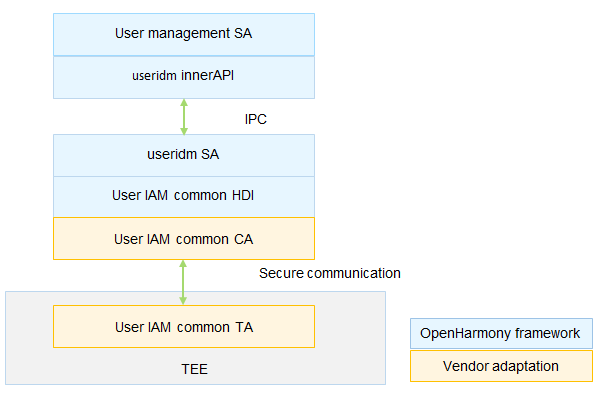

# User Identity Management (useridm)


## Introduction

As a basic component of the user Identity & Access Management (IAM) subsystem, User Identity Management (useridm) provides a unified interface for managing user credential information in the system and invokes authentication resources through the authentication executor management module to implement lifecycle management and secure storage of user credentials.

**Figure 1** useridm architecture



## Directory Structure

```undefined
//base/user_iam/user_idm
├── frameworks			# Framework code
├── interfaces			# Directory for storing external interfaces
│   └── innerkits		# Header files exposed to the internal subsystems
├── sa_profile			# Profile of the Service ability
├── services			# Implementation of the Service ability
├── unittest			# Directory for storing test code
├── utils				# Directory for storing utility code
├── bundle.json			# Component description file
└── useridm.gni			# Build configuration
```


## Usage

### Available APIs

**Table 1** APIs for managing user credentials

| API | Description                            |
| ------ | -------------------------------- |
| addCredential(credentialInfo : CredentialInfo, callback : IIdmCallback) : void; | Adds a user credential.|
| updateCredential(credentialInfo:CredentialInfo, callback:IIdmCallback) : void; | Updates a user credential.|
| delUser(token : Uint8Array, callback : IIdmCallback) : void; | Deletes a Personal Information Number (PIN). When a PIN is deleted, all authentication credentials of the user are also deleted.|
| delCred(credentialId : Uint8Array, token : Uint8Array, callback : IIdmCallback) : void; | Deletes a user credential.|

**Table 2** API for querying user credential information

| API| Description                      |
| ------ | -------------------------------- |
| getAuthInfo(callback : AsyncCallback<Array<EnrolledCredInfo>>,authType? : AuthType) : void; | Obtains one or all types of authentication credentials of a user.|

### Usage Guidelines

- The APIs defined in the header file ```common\interface\useridm_interface.h``` in the [useriam_auth_executor_mgr](https://gitee.com/openharmony-sig/useriam_coauth) repository must be implemented in a Trusted Execution Environment (TEE). In addition, the association between the user credentials and user IDs should not be tampered with, and unified user authentication must be supported.
- During the adaptation, vendors can refer to the software implementation of related functions provided by the OpenHarmony framework.

## Repositories Involved

[useriam_auth_executor_mgr](https://gitee.com/openharmony/useriam_auth_executor_mgr)

**[useriam_user_idm](https://gitee.com/openharmony/useriam_user_idm)**

[useriam_user_auth](https://gitee.com/openharmony/useriam_user_auth)

[useriam_pin_auth](https://gitee.com/openharmony/useriam_pin_auth)

[useriam_faceauth](https://gitee.com/openharmony/useriam_faceauth)
