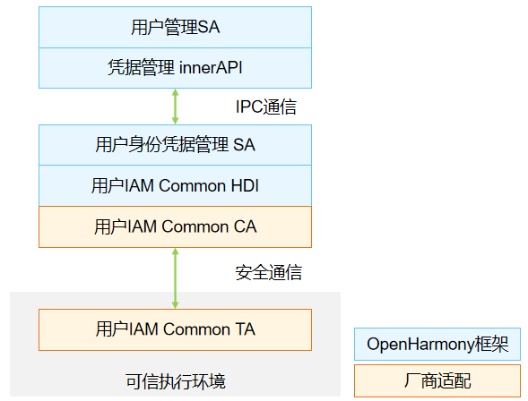

# useriam_useridm

- [简介](#简介)
- [目录](#目录)
- [编译构建](#编译构建)
  - [准备](#准备)
  - [获取源码](#获取源码)
  - [编译构建](#编译构建)

- [说明](#说明)
  - [接口说明](#接口说明)
  - [使用说明](#使用说明)
- [相关仓](#相关仓)


## 简介

**用户身份凭据管理（useridm）**是用户IAM子系统的基础部件之一，向上提供系统内统一的用户身份凭据信息管理（设置、修改和删除）接口，向下通过协同认证模块，调用系统内的认证资源，完成用户身份凭据的生命周期管理和安全存储。

**图1** 用户身份凭据管理架构图



## 目录

```undefined
//base/user_iam/user_idm
├── ohos.build			# 组件描述文件
├── useridm.gni			# 构建配置
├── frameworks			# 框架代码
├── interfaces			# 对外接口存放目录
│   └── innerkits		# 对内部子系统暴露的头文件，供系统服务使用
├── sa_profile			# Service Ability 配置文件
├── services			# Service Ability 服务实现
├── unittest			# 测试代码存放目录
└── utils				# 测试代码存放目录
```

## 编译构建


### 准备

开发者需要在Linux上搭建编译环境：

-   [Ubuntu编译环境准备](https://gitee.com/openharmony/docs/blob/master/zh-cn/device-dev/quick-start/quickstart-lite-env-setup-linux.md)
-   Hi3518EV300单板：参考[环境搭建](https://gitee.com/openharmony/docs/blob/master/zh-cn/device-dev/quick-start/quickstart-lite-steps-hi3518-setting.md)
-   Hi3516DV300单板：参考[环境搭建](https://gitee.com/openharmony/docs/blob/master/zh-cn/device-dev/quick-start/quickstart-lite-steps-hi3516-setting.md)

### 获取源码

在Linux服务器上下载并解压一套源代码，源码获取方式参考[源码获取](https://gitee.com/openharmony/docs/blob/master/zh-cn/device-dev/get-code/sourcecode-acquire.md)。

### 编译构建

开发者开发第一个应用程序可参考：

-   [helloworld for Hi3518EV300](https://gitee.com/openharmony/docs/blob/master/zh-cn/device-dev/quick-start/quickstart-lite-steps-hi3518-running.md)

-   [helloworld for Hi3516DV300](https://gitee.com/openharmony/docs/blob/master/zh-cn/device-dev/quick-start/quickstart-lite-steps-hi3516-running.md)


## 说明

### 接口说明

**表1** 输入框管理接口

| 接口名  | 描述                             |
| ------ | -------------------------------- |
| addCredential(credentialInfo : CredentialInfo, callback : IIdmCallback) : void; | 凭据录入接口 |
| updateCredential(credentialInfo:CredentialInfo, callback:IIdmCallback) : void; | 凭据修改接口 |
| delUser(token : Uint8Array, callback : IIdmCallback) : void; | 口令删除接口，当系统内删除用户口令时，也同时删除该用户的全部认证凭据 |
| delCred(credentialId : Uint8Array, token : Uint8Array, callback : IIdmCallback) : void; | 凭据删除接口 |

**表2** 数据获取和传输接口

| 接口名 | 描述                       |
| ------ | -------------------------------- |
| getAuthInfo(callback : AsyncCallback<Array<EnrolledCredInfo>>,authType? : AuthType) : void; | 信息查询 接口，支持查询用户录入的一类或全部类型认证凭据 |

### 使用说明

- 需在可信执行环境内实现头文件```common\hal\interface\useridm_interface.h``` 中定义的接口，保证用户身份认证凭据信息与用户id的关联关系不可篡改，可以支持统一用户认证功能。

## 相关仓

[useriam_coauth](https://gitee.com/openharmony-sig/useriam_coauth)

[useriam_useridm](https://gitee.com/openharmony-sig/useriam_useridm)

[useriam_userauth](https://gitee.com/openharmony-sig/useriam_userauth)

**[useriam_pinauth](https://gitee.com/openharmony-sig/useriam_pinauth)**

[useriam_faceauth](https://gitee.com/openharmony/useriam_faceauth)

